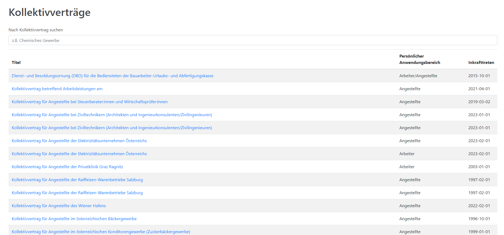
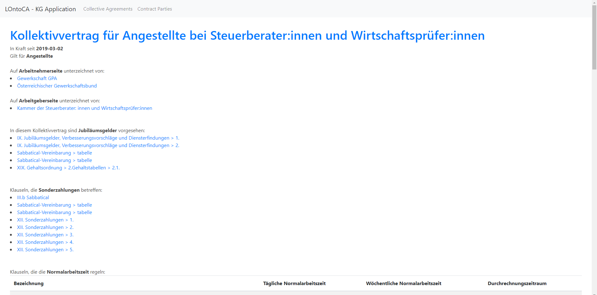
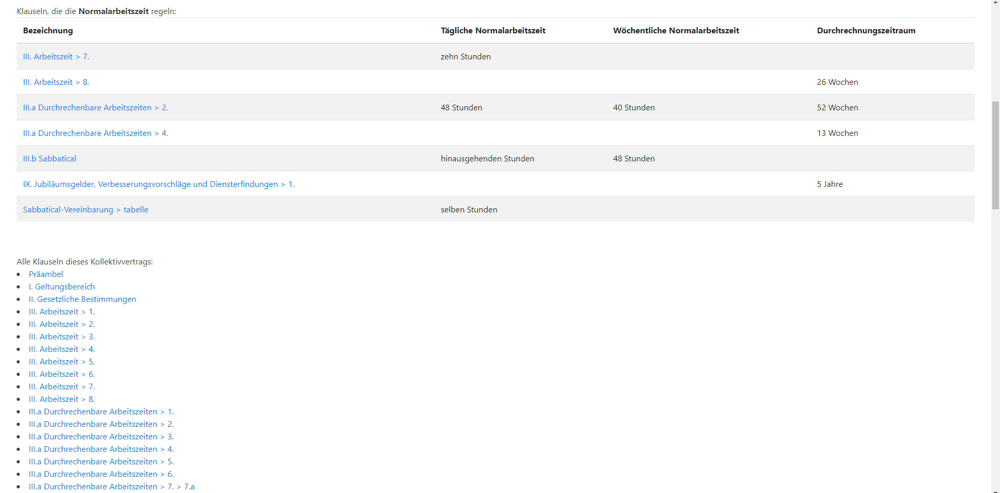
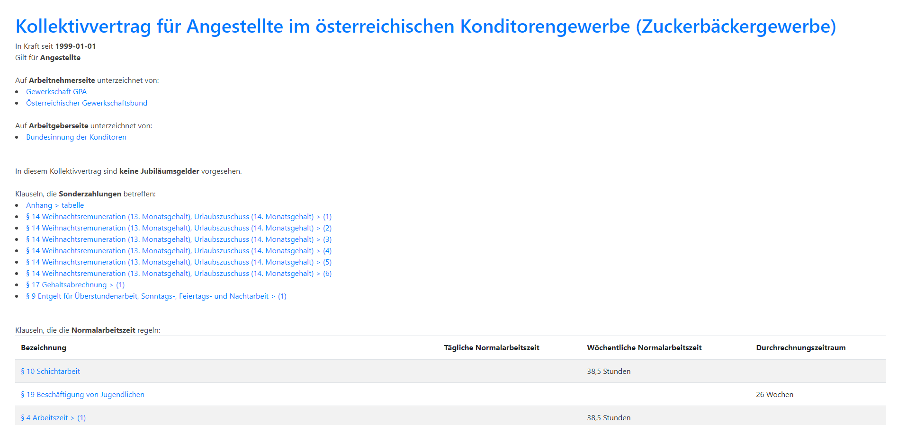
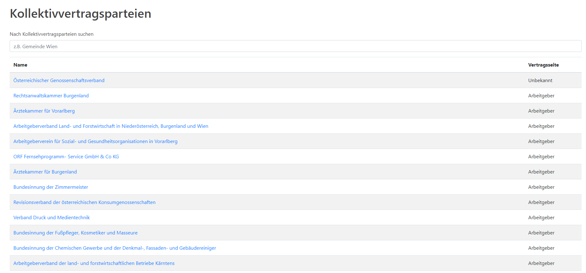
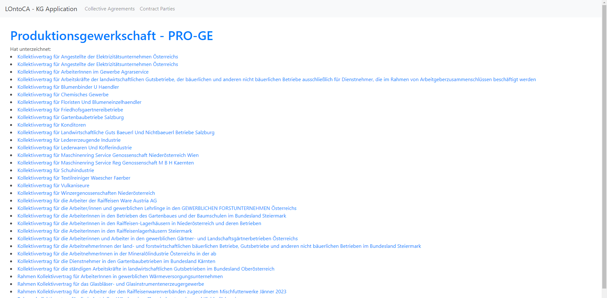

# LOntoCA - KG Application

----

## Motivation

Similar to the caregiver allowance claim in social welfare law, 
employment law claims are about rights of individuals who often 
do not have time to deal with the legal details of their circumstances. 
Moreover, in employment law, there is a great disparity between the power 
positions of the employer and the employee. For this reason, it is even more 
important that employees and legal practitioners in the field of labor law 
are well aware of the legal provisions.

Unfortunately, laws are often written in a very incomprehensible way, so 
that it is often difficult for norm addressees to fully understand the 
meaning of a norm even when reading it carefully. It must be said here 
that even well-trained lawyers can find it difficult to understand norms correctly.

One major problem, for example, is that legal texts are not written in a 
standardized way. A deliberately complicated and convoluted form of 
expression is used, which ultimately obscures the meaning.

This form of lawmaking practice is problematic. For example, the 
collective agreement [Collective Agreement for Guarding Bodies 
in the Guarding Industry](https://www.wko.at/service/kollektivvertrag/kollektivvertrag-wachorgane-bewachungsgewerbe-2021.html#heading_8) 
§ 8 (2) Z 2 states "<em>Working hours 
that exceed the limits of the maximum permissible daily working 
time or weekly working time (60 hours) shall be remunerated as 
overtime with an overtime surcharge of 50% [translated]</em>". This 
clause must be a mistake in the legislation, as it would mean that 
employees can only work overtime if they work an illegal number of hours.   

Thus, it becomes apparent that a purely textual representation of legal 
information is not optimal, not only for the application of law, but also 
for lawmaking. For this reason, this project is working on the transformation 
of collective agreements into a knowledge graph. Collective agreements were 
chosen because they contain similar information (for example, whether special 
payments are due or when the agreement comes into force).

There are already [some systems](https://kvs.oegbverlag.at/erecht-gxt/login.do) 
specifically for working with collective 
agreements. However, these only support simple text searches. 
Although these are helpful, they do not save the user from having to look 
through the entire collective agreement.

Therefore, the goal of this project is to build a simple web application that
allows users to browse the knowledge graph in a standardized way and view certain 
information about collective agreements without requiring the user to go through 
the entire collective agreement.

----

## How to Run the Project

All commands listed below are expected to be run from the root directory of this project.

### Install Dependencies

```shell
conda create -n LOntoCA python=3.10
conda activate LOntoCA
pip install -e .
```

### Download and Preprocess Data

The following command can take a while since it downloads all collective agreements 
from [this page](https://www.kollektivvertrag.at/kv/). In case you have run this command already
and all the collective agreements of interest are in the respective `./data/html/` directory,
you can comment out line 8 in `./data/create_data.py` in order to speed up execution time significantly.

```shell
python data/create_data.py
```

After running this command, the parsed data can be found in `./data/final_csv/` as `.csv` files.

### Populate the Knowledge Graph

This command uses the data from above and transforms it into a knowledge graph based 
on the Legal Ontology for Austrian Collective Agreements 
([LOntoCA](https://semantics.id/ns/CollectiveAgreement#)).

```shell
python scripts/populate_kg.py
```

As a result, a new file `kg.ttl` will be created in the root directory. This file is 
the exported knowledge graph in turtle format. This file can also be found [online](https://owncloud.tuwien.ac.at/index.php/s/TlbgmseG4Z8X4Mq).

### Deploy Knowledge Graph

The application assumes that the sparql endpoint `http://localhost:3030/CollectiveAgreement/sparql`
exists. This endpoint has to accept a POST-request with the query and then return the result rows
as json.

This can be easily achieved using [Apache Jena Fuseki](https://jena.apache.org/documentation/fuseki2/).
Simply deploy this SPARQL server, create a dataset with the name `CollectiveAgreement` 
and add the data from `kg.ttl`.

### Start Web Application

As soon as the SPARQL server is running, the demo web application can be started with
```shell
python application/app.py
```

The application can then be accessed at `http://localhost:5000`.

----

## Application Pages

Screenshots of every page are included in `./demo-screenshots/`.

### Contracts Overview

This page lists all collective agreements that are in the knowledge graph (currently 241).



### Contract Details

This page displays automatically extracted information for one contract.





### Contract Parties Overview

This page lists all entities that have signed at least one collective agreement.



### Contract Party 

This page displays which collective agreements were signed by one contract party.



----

## Further Development

Since this is just a proof-of-concept, the final application is <em>very</em> basic and does not
offer essential functionalities such as a search function. Furthermore, the knowledge graph could
be extended by adding more attributes to the extraction process.

The final goal would be to extend the ontology to also represent legal rules themselves and 
extract these data from the clauses which would then allow for automatic decision-making.

## Further Information

### Known Issues of the Current Version

#### Technical Issues and Limitations

1. Since the original data is not standardized, there are some problems with the parsing mechanism.
The HTML-tags `text_gr_dist` and `text_grtit` are not handled yet, which leads to an incorrect
and ugly representation of clauses that include these elements. Also, some contract titles
are not extracted correctly.

2. Another imperfection is that the manually added sample instances are never deleted
   from the knowledge graph.

3. Furthermore, some collective agreements seem to not be picked up by the download script
   (for example [this one](https://www.kollektivvertrag.at/kv/wachorgane-bewachungsgewerbe-arb)).

4. Current application is prone to SPARQL-injections.

#### Usability Issues

1. Some contracts have the same title which makes it impossible for a user to distinguish between
   them.

2. The current design is <em>extremely</em> basic and not practical.

### Disclaimer

The knowledge graph and extracted information generated by this project 
are provided "as is" without warranty of any kind, either expressed or implied, 
including, but not limited to, the implied warranties of correctness, accuracy, 
reliability, or fitness for a particular purpose. The author of this project does 
not guarantee the correctness of the resulting knowledge graph or the extracted 
information, nor does the author assume any liability for the use or interpretation 
of the information provided. The user assumes all responsibility and risk associated 
with the use of this project.